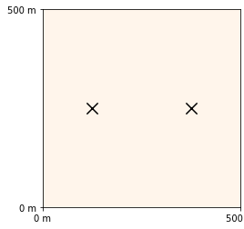
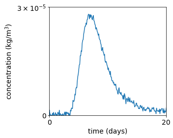
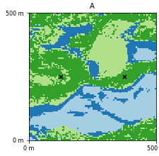

# Tracer test data example

We present here tracer test data from the following publication:
https://doi.org/10.3389/frai.2021.624629  
The test case described in the paper is avalable here: 
https://github.com/randlab/ml-popex

## The inverse problem

The injection well is placed at position (125 m, 250 m) and the pumping well at (275 m, 250 m), so 250 m apart.
 

Boundary-conditions: no-flow on north and south, 0.5 m west (left boundary), 0 , east (right boundary).

Pumping: $0.07 m^3/s = 70 l/s$ (considered steady-state)  
Injection: $1/3600 m^3/s = 10/36 l/s = 1 m^3/h$ during 1h

Concentration is constant in the injected water: $1 kg/m^3$, so a total of 1 kg of tracer are flushed into the well. Contrary to the cited paper, all data points are used in this inversion example.

The domain is modelled using 4 geological facies with different physical properties and geological facies in the injection point and in the pumping point are considered to be known.
Example field looks like:

## Using PoPEx to solve the problem

To run the inversion, use the script: `python run-popex.py`.

### Prior probability maps
We included `q_cat.prob` file containing prior probabilities but it is not required. To generate q_cat map using popex, specify `path_q_cat=None` as argument in `algorithm.run_popex_mp`

### `Problem` definition
`generate_m` function, `compute_log_p_lik` function and `get_hd_pri` function must be specified in `Problem` constructor.
The `generate_m` and `get_hd_pri` functions  are related to the geostatistical method and are defined in `fluvial.py`. The `compute_log_p_lik` considers data mismatch (the forward problem) and is implemented in `tracer.py`. 